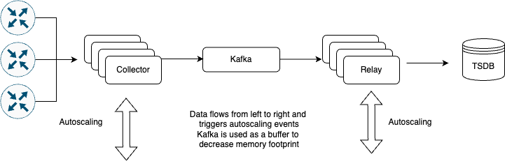

# gNMIc Cluster
This project enables users to run an autoscaling [gNMIc](https://gnmic.openconfig.net/) cluster on kubernetes. [gNMIc](https://gnmic.openconfig.net/) is an openconfig project
that allows users to stream telemetry from gNMI enabled routers.

This project was co-funded by [GEANT](https://geant.org) in the GN5-1 WP6 Incubator.
## Telemetry pipeline architecture




## Prerequisites

- Kubernetes cluster
- A strimzi operator and kafka cluster deployment within your k8s cluster [Strimzi](https://strimzi.io/downloads/)
- Minimum CPU and RAM for 300 Routers and subscription to all metrics for processing +/- 2 billion events per day


    | CPU | Memory| Storage (90 days retention) |
    |---|---| --- |
    | 20 | 160Gi  | 3Ti |


## Installation

```bash
helm repo add gnmic-cluster-chart https://workfloworchestrator.org/gnmic-cluster-chart/
helm repo update
helm upgrade --install gnmic-cluster gnmic-cluster-chart/gnmic-cluster
```


# Helm Chart Documentation
# gnmic-cluster

  

This chart deploys a gNMIc cluster. This application enables users to stream telemetry from gNMI capable routers.

**Homepage:** <https://workfloworchestrator/gnmic-cluster-chart>

## Maintainers

| Name | Email | Url |
| ---- | ------ | --- |
| Workflow Orchestrator Programme | <workfloworchestrator.board@commonsconservancy.org> | <https://workfloworchestrator.org> |

## Source Code

* <https://github.com/workfloworchestrator/gnmic-cluster-chart/tree/main/charts/gnmic>

## Requirements

| Repository | Name | Version |
|------------|------|---------|
| https://emberstack.github.io/helm-charts | reflector | 7.1.288 |
| oci://registry-1.docker.io/bitnamicharts | redis | 20.1.5 |

## Values

| Key | Type | Default | Description |
|-----|------|---------|-------------|
| affinity | object | `{}` | Affinity for the k8s scheduler, this is a mapping per collector and relay |
| autoscaling | object | `{"enabled":true,"locker":"consul","maxReplicas":30,"minReplicas":4,"targetCPUUtilizationPercentage":80}` | Autscaling configuration, enabled by default to maximise the efficiency of collection. |
| autoscaling.enabled | bool | `true` | Autoscaling enabled |
| autoscaling.locker | string | `"consul"` | 'consul' or 'k8s' |
| autoscaling.maxReplicas | int | `30` | Autoscaling upper bound |
| autoscaling.minReplicas | int | `4` | Autoscaling lower bound |
| autoscaling.targetCPUUtilizationPercentage | int | `80` | targetCPUUtilizationPercentage or targetMemoryUtilizationPercentage |
| config | object | `{"collector":{},"global":{"api-server":{"address":":7890","debug":false,"enable-metrics":true},"debug":false,"encoding":"proto","format":"event","gzip":false,"password":"${GNMIC_PASSWORD}","skip-verify":true,"username":"${GNMIC_USERNAME}"},"relay":{}}` | gNMIc configuration |
| config.collector | object | `{}` | Collector configuration, must be provided in yaml by following the instructions here: https://gnmic.openconfig.net/user_guide/subscriptions/ |
| config.global | object | `{"api-server":{"address":":7890","debug":false,"enable-metrics":true},"debug":false,"encoding":"proto","format":"event","gzip":false,"password":"${GNMIC_PASSWORD}","skip-verify":true,"username":"${GNMIC_USERNAME}"}` | Global gNMIc Configuration extra keys can be added or removed according to: https://gnmic.openconfig.net/user_guide/configuration_file/#global-flags |
| config.global.password | string | `"${GNMIC_PASSWORD}"` | An example of using environment value variables |
| config.global.username | string | `"${GNMIC_USERNAME}"` | An example of using environment value variables |
| config.relay | object | `{}` | Relay configuration, must be provided in yaml by following the instructions here: https://gnmic.openconfig.net/user_guide/outputs/ |
| cronjob.annotations | object | `{}` | Extra annotations for the Cronjob |
| cronjob.schedule | string | `"* * * * *"` | Cronjob schedule |
| fullnameOverride | string | `""` | Fullname override |
| image.pullPolicy | string | `"Always"` | Image pull policy. |
| image.repository | string | `"ghcr.io/openconfig/gnmic"` | Image repository. |
| image.tag | string | `"latest"` | Overrides the image tag whose default is the chart appVersion. |
| imagePullSecrets | list | `[]` | Required for private image repository |
| ingress.annotations | object | `{}` | Ingress annotations |
| ingress.className | string | `""` | The ingress class name |
| ingress.enabled | bool | `false` | The ingress for the Api |
| ingress.hosts | list | `[]` | The ingress host rules |
| ingress.tls | list | `[]` | TLS rules |
| kafka | object | `{"bootstrap_server":"","cluster":"","enabled":true,"group":"gnmic-collector","kafka_namespace":"","topic":{"config":{},"name":"gnmic-telemetry","partitions":15,"patternType":"literal","replicas":3},"user":{"mechanism":"scram-sha-512","name":"gnmic"}}` | Requires a Strimzi Operator inside the cluster and an active Kafka deployment https://strimzi.io/documentation/ |
| kafka.bootstrap_server | string | `""` | Kafka Bootstrap address: fqdn + port. eg: kafka-bootstrap.production.svc.cluster.local:9094 |
| kafka.cluster | string | `""` | The name of the cluster inside the |
| kafka.enabled | bool | `true` | Enabling this will create the strimzi artefacts to create the kafka objects in K8s. This will also configure the secret reflector so the kafka user secret can be |
| kafka.group | string | `"gnmic-collector"` | The kafka user group |
| kafka.kafka_namespace | string | `""` | The namespace where the kafka manifests need to be installed so the operator can create the user topics and rolebindings |
| kafka.topic | object | `{"config":{},"name":"gnmic-telemetry","partitions":15,"patternType":"literal","replicas":3}` | Kafka topic configuration |
| kafka.topic.config | object | `{}` | Kafka Topic configuration |
| kafka.topic.name | string | `"gnmic-telemetry"` | Topic name |
| kafka.topic.partitions | int | `15` | Minumum number of partitions (cruise control may scale to more) |
| kafka.topic.patternType | string | `"literal"` | Literal or Prefix |
| kafka.topic.replicas | int | `3` | Minimum number of replicas ( num(replicas) =< num(kafka_nodes) |
| kafka.user | object | `{"mechanism":"scram-sha-512","name":"gnmic"}` | The kafka user configuration |
| nameOverride | string | `""` | Name override |
| podAnnotations | object | `{}` | Any extra pod annotations |
| podLabels | object | `{}` | Any extra pod annotations |
| podSecurityContext | object | `{}` | The Custom security context written in Yaml |
| redis | object | `{"enabled":false}` | Optional deployment of redis inside the namespace. This |
| redis.enabled | bool | `false` | Enable or disable usage of the Bitnami redis |
| reflector | object | `{"enabled":false}` | Optional deployment of the secret reflector. This is necesarry when running the |
| replicaCount | int | `3` | Number of replicas for the Collector and Relay statefulset. This will be overridden when autoscaling is activated |
| resources.collector | object | `{}` | Resources for the collector, mandatory for functional autoscaling |
| resources.consul | object | `{}` | Resources for the consul deployment |
| resources.relay | object | `{}` | Resources for the relay, mandatory for functional autoscaling |
| secrets | object | `{"name":"gnmic-secret","opaque":{"enabled":false,"items":{}},"secret_provider":{"config":{"keyvault":"","nodePublishSecretRefName":"","provider":"","tenantId":""},"enabled":false,"objects":[]}}` | Secret configuration |
| secrets.name | string | `"gnmic-secret"` | Name of the secret |
| secrets.opaque | object | `{"enabled":false,"items":{}}` | Usimg an opaque secret inside kubernets |
| secrets.opaque.enabled | bool | `false` | Whether it is enabled |
| secrets.opaque.items | object | `{}` | Secret items |
| secrets.secret_provider | object | `{"config":{"keyvault":"","nodePublishSecretRefName":"","provider":"","tenantId":""},"enabled":false,"objects":[]}` | Using a secret provider allows the user to inject secrets from a vault or cloud provider |
| secrets.secret_provider.config | object | `{"keyvault":"","nodePublishSecretRefName":"","provider":"","tenantId":""}` | K8s secret provider configuration |
| secrets.secret_provider.config.keyvault | string | `""` | Name of the keyvault |
| secrets.secret_provider.config.nodePublishSecretRefName | string | `""` | Secret with credentials to access the keyvault |
| secrets.secret_provider.config.provider | string | `""` | eg: azure |
| secrets.secret_provider.config.tenantId | string | `""` | Tenant id |
| secrets.secret_provider.enabled | bool | `false` | Secret provider enabled |
| secrets.secret_provider.objects | list | `[]` | List of objects to retrieve from the keyvault. These objects will be mapped to enviroment variables inside the containers |
| server | object | `{"cache":{"type":"redis"},"enabled":true,"port":57400}` | gNMI server capabilities: https://gnmic.openconfig.net/user_guide/gnmi_server/ |
| server.cache | object | `{"type":"redis"}` | Override of the default cache |
| server.cache.type | string | `"redis"` | Supports a cache Structure as defined here: https://gnmic.openconfig.net/user_guide/caching/ Default is redis |
| server.enabled | bool | `true` | Whether the server is enabled |
| server.port | int | `57400` | Default port |
| service.annotations | object | `{}` | The extra service annotations to be compatible with clouds |
| service.externalTrafficPolicy | string | `"Cluster"` | The ExternalTrafficPolicy |
| service.port | int | `7890` | The port being exposed |
| service.type | string | `"ClusterIP"` | The type of service |
| serviceAccount.annotations | object | `{}` | Annotations to add to the service account |
| serviceAccount.automount | bool | `true` | Automatically mount a ServiceAccount's API credentials? |
| serviceAccount.create | bool | `true` | Specifies whether a service account should be created, must be set to true when using the k8s locker |
| serviceAccount.name | string | `""` | The name of the service account to use. If not set and create is true, a name is generated using the fullname template |
| servicemonitor.enabled | bool | `false` | For monitoring by Prometheus |
| tolerations | object | `{}` | Tolerations for the k8s scheduler, this is a mapping per collector and relay |

----------------------------------------------
Autogenerated from chart metadata using [helm-docs v1.14.2](https://github.com/norwoodj/helm-docs/releases/v1.14.2)


# Updating documentation
The Helm chart and readme are documented separately.

### Helm
The Helm chart is documented use `helm-docs` [Link](https://github.com/norwoodj/helm-docs)
Run it as follows:

```bash
helm-docs .
```

### Readme generation
The README generation is done by editing the `README.md.tpl` file. and running the command

```bash
md_incl README.md.tpl README.md
```

This assumes you have `md_incl` installed. [link](https://pypi.org/project/md-incl/)